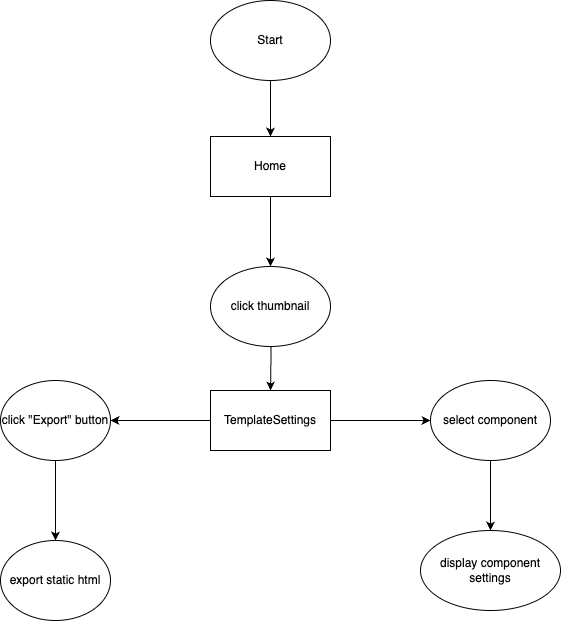
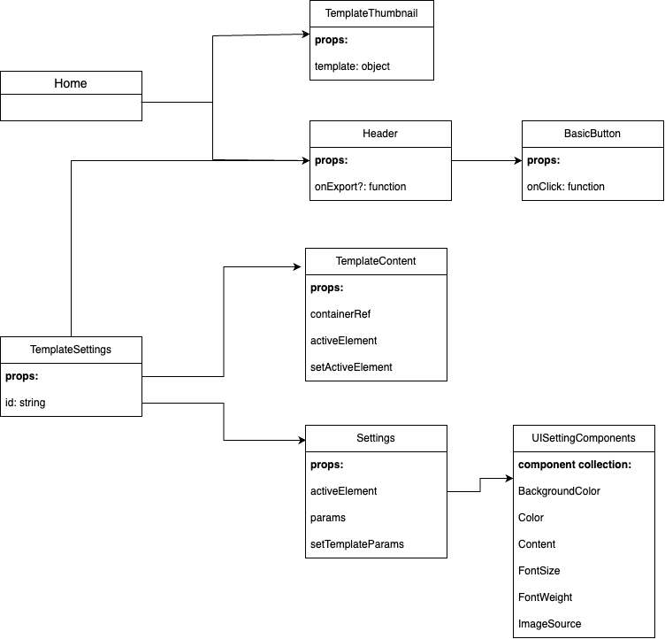
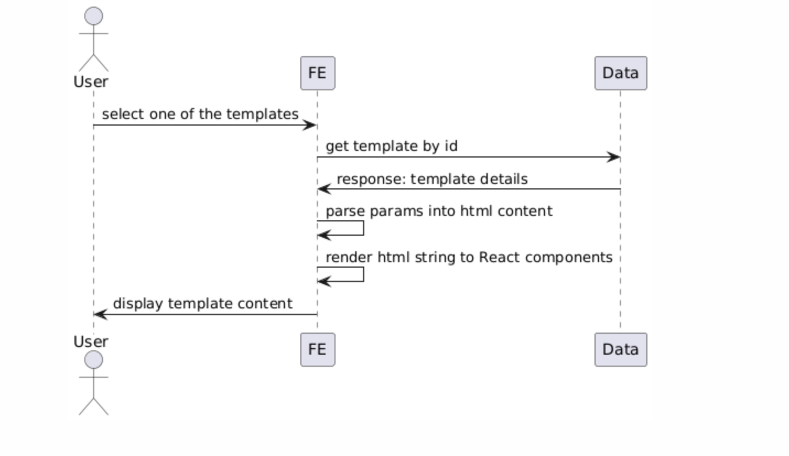
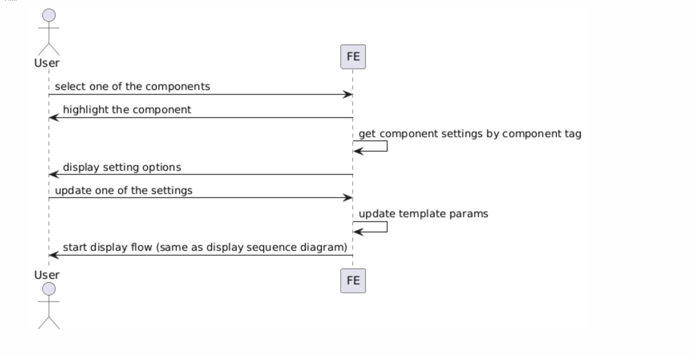
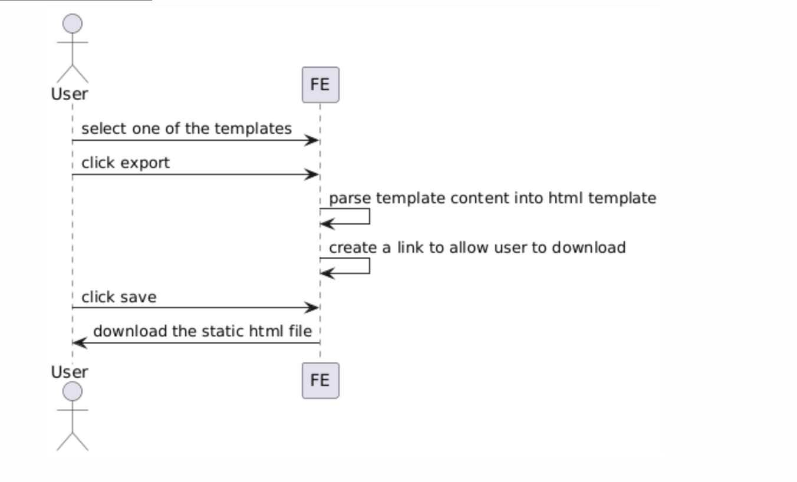

# Welcome to Web Builder!

Please refer to this technical design for overall architecture and rationale behind the implementation

## Folder Structure

```
├── package.json
├── package-lock.json
├── app
    ├── assets/        # Static assets
    ├── components/    # Common components
    ├── constants/     # constants
    ├── data/          # BE responses (real world: replaced by services)
    ├── docs/          # materials for the tech design
    ├── pages/         # pages
    ├── typing/        # typescript types
    ├── utils/         # utility functions
```

## Main flow



## Component Tree



## Sequence Diagrams

### Display template



### Update template



### Export template



## State managements

The project is relatively small so it does not need any third-party state management, using React state is enough

## Improvements

- Setup unit tests
- Setup pre-commit hooks
- Set backend and database
